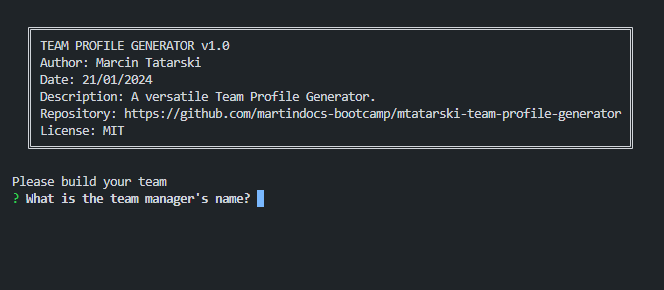
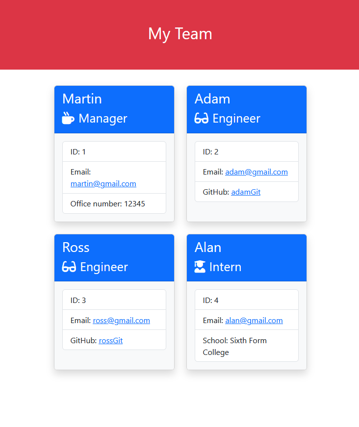
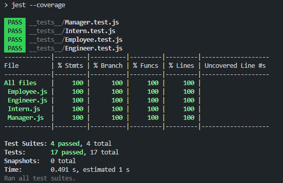

# Team Profile Generator 

## Overview

The Team Profile Generator is a Node.js command-line application designed to streamline the process of generating a webpage displaying a software engineering team's basic information. The application accepts user input, creating profiles for team members and generating an HTML webpage with summaries for each person. The project adheres to a test-driven development approach, utilizing Jest for testing and achieving 100% coverage for the implemented classes.

The primary tools used include:

- **Node.js (v19.4.0):** powers the Readme Generator, providing a robust JavaScript runtime for executing command-line operations efficiently. 

## Table of Contents
- [Screenshots](#screenshots)
- [Installation](#installation)
- [How to Use](#how-to-use)
- [Dependencies](#dependencies)
- [Features](#features)
- [Tests](#tests)
- [Contributions](#contributions)
- [Questions](#questions)
- [License](#license)

## Screenshots



*The Profile Generator command-line main screen.*



*The Generated HTML page main screen.*


## Installation

To use the Readme Generator, follow these steps:

1. Ensure you have [Node.js](https://nodejs.org) installed.
2. Clone this repository to your local machine.

```sh
git clone https://github.com/martindocs-bootcamp/mtatarski-team-profile-generator.git
```

3. Navigate to the project directory.

```sh
cd mtatarski-team-profile-generator
```

4. Install dependencies.

```sh
npm install
```

## How to Use


1. Run the application using the following command:

```sh
node index.js
```

2. Follow the prompts to enter information for the team manager, engineers, and interns.
3. Choose to add an engineer, add an intern, or finish building the team.
4. Upon completion, the HTML file is generated in the `output` folder as team.html.

## Dependencies

The following Node.js packages are utilized in this project:

```sh
npm install inquirer@6.3.1 commander@11.1.0 minimist@1.2.8
```

- **Inquirer**: A powerful package for handling user prompts, enabling dynamic input in the command line.
- **Jest**: Utilized for testing classes and achieving 100% coverage.

## Features

The Team Profile Generator offers the following key features:

- **Dynamic Profile Generation:** The application allows the user to dynamically generate profiles for team members, including managers, engineers, and interns.
- **Bootstrap Card Display:** The generated HTML showcases team members in Bootstrap cards, providing a visually appealing and organized presentation.
- **Comprehensive Validation:** The application incorporates extensive validation to ensure that user inputs match the required formats. It restricts input types based on the specific information needed (e.g., only string values for names, proper email structures).
- **Flexible Team Structure:** Users can add as many or as few team members as needed, with the ability to include both engineers and interns.
- **HTML Output:** The final output is an HTML file (team.html) containing all the generated profiles, making it easy to share and view.

## Tests
The application uses Jest for testing classes. All tests are located in the `_tests_` directory, and coverage reports are available.

To run tests for the classes, use the following command:

```sh
npm run jest
```

To run tests and check coverage, use:

```sh
npm run test
```


## Contributions

Contributions are welcome! Here are several ways you can contribute:

- **[Report Issues](https://github.com/martindocs-bootcamp/mtatarski-team-profile-generator/issues)**: Submit bugs found or log feature requests.

#### *Contributing Guidelines*

<details closed>
<summary>Click to expand</summary>

1. **Fork the Repository**: Start by forking the project repository to your GitHub account.
2. **Clone Locally**: Clone the forked repository to your local machine using a Git client.
   ```sh
   git clone <your-forked-repo-url>
   ```
3. **Create a New Branch**: Always work on a new branch, giving it a descriptive name.
   ```sh
   git checkout -b new-feature-x
   ```

4. **Make Your Changes**: Develop and test your changes locally.
5. **Add Changes to Staging Area**:
   ```sh
   git add -A 
   ```
6. **Commit Your Changes**: Commit with a clear and concise message describing your updates.
   ```sh
   git commit -m 'Implemented new feature x.'
   ```
7. **Push to GitHub**: Push the changes to your forked repository.
   ```sh
   git push origin new-feature-x
   ```
8. **Submit a Pull Request**: Create a PR against the original project repository. Clearly describe the changes and their motivations.

  Once your PR is reviewed and approved, it will be merged into the main branch.

9. **Switch Back to Main Branch and Pull Sync with Main**: If you wish to work on a new feature/change, switch back to the main branch and sync with the latest changes.
  ```sh
  git checkout main
  git pull origin main
  ```
10. **Repeat the Process if Necessary**: Start from point 3 onwards.

</details>

## Questions
If you have any questions, feel free to reach out to me via [GitHub](https://github.com/martindocs).

## License

Please refer to the [LICENSE](./LICENSE.md) file in this repository for details on how this project is licensed.
